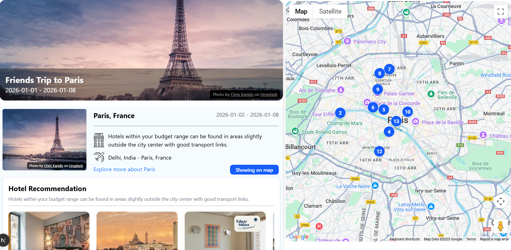

# TripForge-AI 🌍✈️

**AI-powered travel itinerary planner** with real-time flight/hotel data, multi-city support, and dynamic Google Maps integration.

## 🚀 Features

- 🤖 **AI-Generated Itineraries** – Powered by Gemini AI with optimization for multi-city travel and user constraints  
- 🌐 **Multi-API Integration** – Amadeus (Flights/Hotels), Booking.com, Google Maps, Unsplash  
- 🏨 **Hotel Search & Display** – Integrated from multiple APIs with card-based UI  
- 🗺️ **Dynamic Mapping** – Google Maps with activity markers and geolocation support  
- 🔐 **User Authentication** – Google, Facebook, Apple, and password login via NextAuth.js  
- 💾 **Trip Saving** – Persist user trips in MongoDB with secure, session-based access  
- ⚙️ **State Management** – Global state handled via Redux with modular slices  
- 🎨 **Modern UI** – Built with Tailwind CSS for responsiveness and clean design

## 🛠️ Tech Stack

- **Frontend:** React.js, Next.js, Tailwind CSS  
- **Backend:** Node.js, Express.js, MongoDB (Mongoose)  
- **State Management:** Redux  
- **Authentication:** NextAuth.js  
- **APIs Used:**  
  - Gemini AI (Google)  
  - Amadeus (Flights/Hotels)  
  - Booking.com  
  - Google Maps JavaScript API  
  - Unsplash (for dynamic activity images)

## 📸 Screenshots



## 🔗 Live Demo

👉 [tripforge-ai.vercel.app](https://tripforge-ai.vercel.app)

## 📌 Setup Instructions

```bash
git clone https://github.com/yourusername/tripforge-ai.git
cd tripforge-ai
npm install
# Add .env with your API keys
npm run dev
```

## 💡 Future Improvements
- Add chat-based trip refinement
- Offline itinerary export (PDF)
- Calendar sync (Google/Outlook)

## 📬 Contact
**Yugam Jain**
- 📧 yugamjain068@gmail.com
- 🔗 [LinkedIn](https://www.linkedin.com/in/yugam-jain-0169b034a/?originalSubdomain=in) | [GitHub](https://github.com/YugamJain068)
